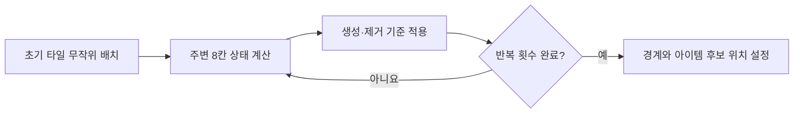

# InEarth2

Unity와 C#으로 제작한 팀 게임 프로젝트의 스크립트 보존 저장소입니다.
이 저장소는 2022년에 정리한 당시 코드의 스냅숏이며, 전체 Unity 프로젝트와 게임 리소스는 포함하지 않습니다.

## 프로젝트 개요

| 구분 | 내용 |
| --- | --- |
| 개발 형태 | 팀 프로젝트 |
| 사용 기술 | Unity, C# |
| 주요 영역 | 격자형 맵, 플레이어·몬스터 전투, 스킬·아이템 |
| 저장소 상태 | 당시 작성한 스크립트와 일부 Unity 파일을 보존한 코드 자료 |

## 담당 및 기여 범위

- 맵 환경과 플레이어·몬스터 스킬 관련 기능 개발
- 주변 타일 상태를 반복 반영하는 랜덤 맵 생성 방식 제안
- 공동 개발자와 연쇄 번개의 처리 방식과 표현 순서를 논의하고 수정
- 캐릭터·몬스터·스킬·아이템 데이터를 `ScriptableObject`로 구성

랜덤 맵은 기획 단계에서 생성 방식을 제안한 항목이며, 연쇄 번개는 공동 개발자와 함께 구현 방식을 조정한 항목입니다. 저장소의 모든 코드를 단독 구현한 것으로 표시하지 않습니다.

## 핵심 구현

### 1. 격자형 랜덤 맵 생성

초기 타일을 무작위로 배치한 뒤 주변 8개 타일의 상태를 확인하여 벽과 빈 공간을 반복 갱신합니다. 생성이 끝난 후에는 경계 타일을 막고, 이동 및 아이템 배치에 사용할 수 있는 위치를 별도로 수집합니다.

관련 코드:

- [MapManager.cs](./MapManager.cs): `GenerateWorld`, `doSimulationStep`, `countAliveNeighbours`
- [Maptile.cs](./ScriptTable/Maptile.cs): 맵 크기, 초기 생성 확률, 반복 횟수와 생성·제거 기준

### 2. 연쇄 번개

연쇄 대상을 처음부터 모두 고정하지 않고, 타격마다 현재 격자 상태에서 다음 대상을 확인합니다. 번개 효과가 대상에게 도착한 뒤 피해를 적용하며, 연결 가능한 대상이 없으면 종료합니다.

관련 코드:

- [Skill.cs](./ScriptTable/Skill.cs): 연쇄 번개 발동 조건과 횟수 설정
- [Player.cs](./Player.cs): `makeChainLight`, `returnNearEnemy`

### 3. 격자 상태 관리

각 타일에 벽·빈 공간·아이템·적·플레이어 상태를 기록하고, 전투와 이동 기능이 동일한 맵 상태를 조회하도록 구성했습니다.

관련 코드:

- [MapManager.cs](./MapManager.cs): `ReadCode`, `getTileData`, `tileNodeSortSet`

## 코드 안내 문서

- [핵심 코드 흐름](./docs/CODE_WALKTHROUGH.md)
- [현재 관점의 회고와 개선 방향](./docs/RETROSPECTIVE.md)

## 저장소 제한사항

- 전체 Unity 프로젝트가 아니므로 이 저장소만으로 게임을 실행할 수 없습니다.
- 원본 씬, 프리팹, 사운드와 이미지 등 일부 리소스가 포함되어 있지 않습니다.
- 당시 학습·개발 과정의 코드를 보존한 자료이므로 현재의 코드 작성 기준과 차이가 있습니다.
- 별도 라이선스를 제공하지 않으며, 공개 저장소는 오픈소스 사용 허가를 의미하지 않습니다.
